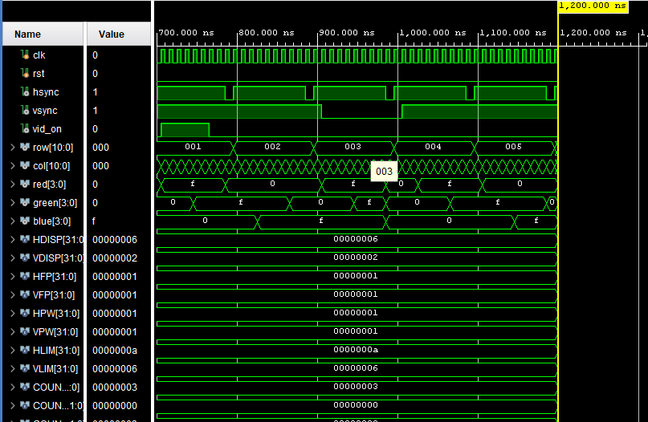
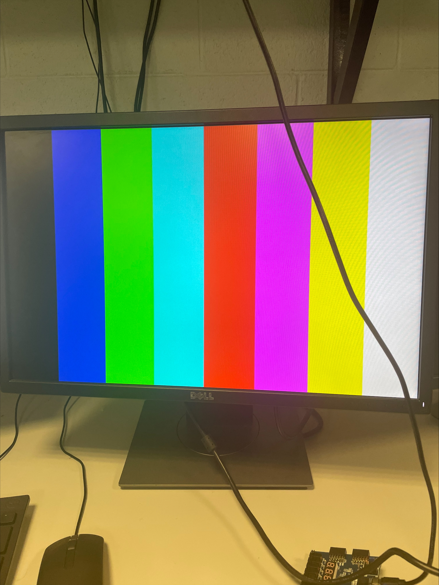
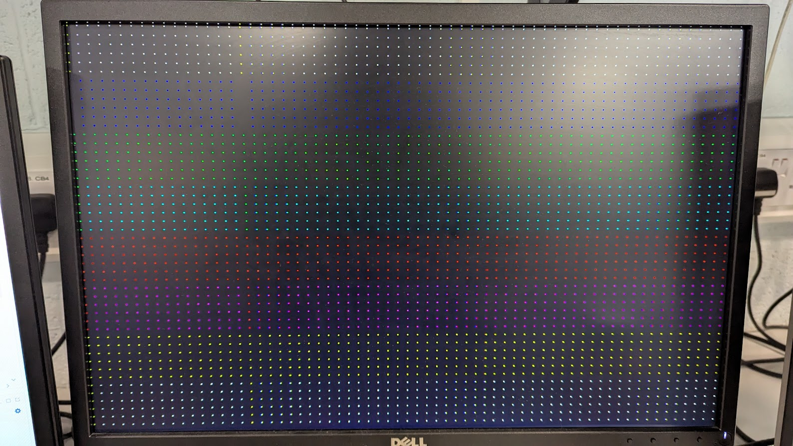
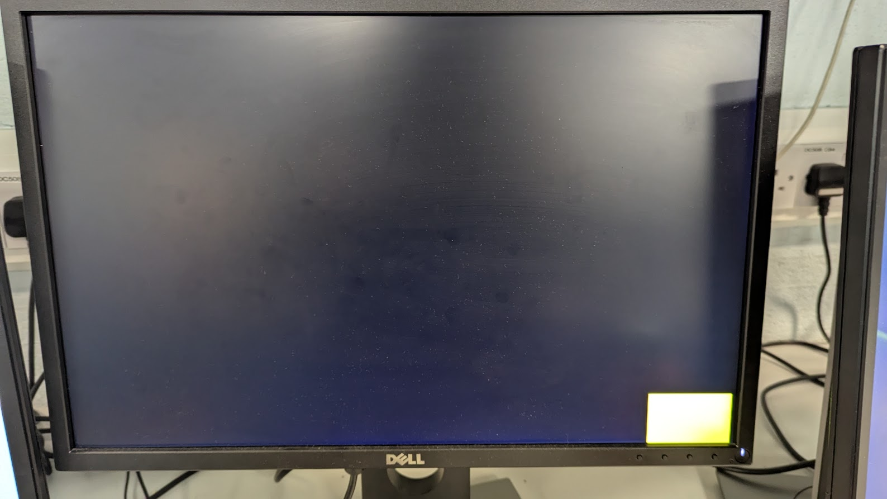
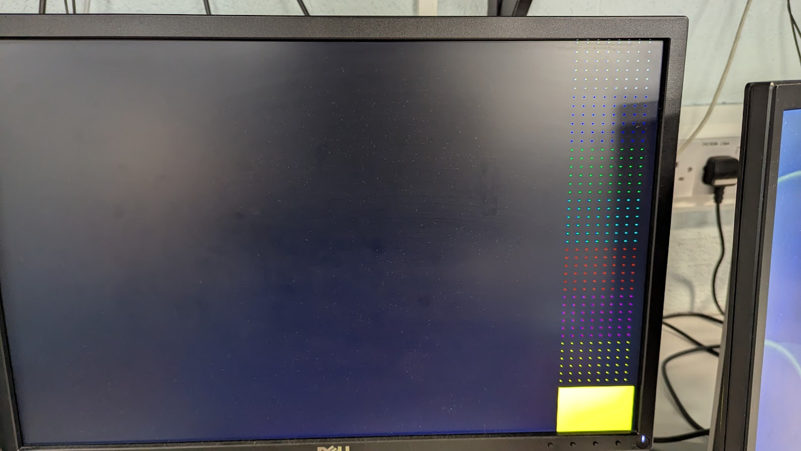

Hello my name is Nasir Ahmad. This is my project for the module System on Chip Design. In this project I used a Basys 3 Artix-7 FPGA board to display a VGA (VIdeo Graphics Array) image that I created using Vivado. The project was coded in verilog.

## **Template VGA Design**
### **Project Set-Up**
Summarise the set-up and design flow. Include a screenshot of your own set-up, for example see the image of my Project Summary window below. Guideline 1 short paragraph.

We were given template code by our professor Michelle Lynch. This was uploaded to moodle for our use. The first thing I did was set up my project by downloading the template code from moodle and importing it into a project within vivado. The template code included a VGATop.v, VGASync.v, VGAColorCycle.v, Testbench.v and Basys3_Master.xdc. I changed the clock frequancy to 25MHz using the clock wizard. This was done to match the timing of the VGA signal. The VGA resolution was 480x640.

### **Template Code**
Outline the structure and design of the Verilog code templates you were given. What do they do? Include reference to how a VGA interface works. Guideline: 2/3 short paragraphs, consider including screenshot(s).

There are two main templates for creating the images. These are **ColourCycle.v** and **ColourStripes.v**. 

**ColourCycle.v** uses a state machine to change the state of the code. Each state represented a colour going from black, red, yellow, green, cyan, blue, white and then back to black as it starts repeating. The next state is selected once counter has reached COUNT_TO. Thia allows us to see the colour for long enough before switch to the next state.  The screen was coloured using a 12-bit value. The 12-bit value was split into three different parts before being written to the colour register. The first four bits represeent the red value, the second four bits represent the green value and the last four bits represents the blue value. For example 0000 0000 0000 woould be black and 1111 0000 0000 would be red. ColourCycle.v uses three registers to write the colours to. These are the red, green and blue registers. 

**ColourStripes.v** Produces vertical lines of colour using inputs roe and col. These represent the row and coloumn of the VGA screen. ColourStrpies.v uses `if statements` to change the colour of the screen depending on the specific rows and columns. For example when the column is in the ranges 0 - 80 the colour will be black. ColourStripes.v also uses three registers for the colours just like in ColourCycle.v except it just assigns the three registers to the three color registers on each positive clock edge.
### **Simulation**

Explain the simulation process. Reference any important details, include a well-selected screenshot of the simulation. Guideline: 1/2 short paragraphs.

In this process we use testbench.v to generate a simulation. We can use the simulation to test our code quickly rather than having to generate a bitstream each time which take a long time to genearate. This is because generating a bitstream involves also generating a new synthesis and implemention first which both take quite a bit of time on there own. Using the simulation we can get an idea of what the VGA output might look like. 

When running the simulation Vivado will open a waveform viewer. This displays the signals that would be generated by your code and testbench. With this we can determine if our code is working as intended.

**ColourStripes Testbench**

### **Synthesis**
Describe the synthesis and implementation processes. Consider including 1/2 useful screenshot(s). Guideline: 1/2 short paragraphs.

Synthesis generates a netlist from your RTL(Register Transfer Level) code. The netlist contains information about the general logic blocks being used and how they are connnected.
### **Demonstration**
Perhaps add a picture of your demo. Guideline: 1/2 sentences.

I connected the Basys 3 board to the monitor with a VGA cable and these were the outputs.

**ColourCycle.v Demo**

**ColourStripes.v Demo** 

## **My VGA Design Edit**
Introduce your own design idea. Consider how complex/achievabble this might be or otherwise. Reference any research you do online (use hyperlinks).

My first idea was to create a checkerboard pattern . I wanted to use for loops to create a checkerboard pattern but trying to see how to properly use for loops in verilog was time consuming. In addition to this generating the bitstream each time took too long. Moving on from that I tried experimenting with the code trying to see what would happen if I used if statements and modulo. I used techniques from both ColourCycle.v and ColourStripes.v. For example I used three registers for changing the colours. I assigned my designs to two different switches. My design shows you different coloured dots across the screen in a grid pattern on switch 1 and a yellow square in the bottom right corner on switch 2. You can combine these two images to create a column of dots with a yellow square in the corner.

### **Code Adaptation**
Briefly show how you changed the template code to display a different image. Demonstrate your understanding. Guideline: 1-2 short paragraphs.

To create different images depending on which switch was on, I went into the Basys3_Master.xdc file to change the name of the switch and also tell the board that the switch is not a clock using `set_property CLOCK_DEDICATED_ROUTE FALSE [get_nets img1_IBUF]`. I also added img1 and img2 as inputs into my ColourCycle.v and VGATop.v file. This lets the board access img1 and img2. Now in the ColourCycle.v I can use the condition `if(img1 == 1'b1)` and `if(img2 == 1'b1)` to display the images. I used if statments for both so that img2 could be overlayed on top of img1.

Like in ColourStripes.v I used `if statements` to assign different pixels a colour value. In ColourStripes.v the only use col to change the colours within certain columns which created stripes. I changed this to use both columns and rows. So that the pixels would change colour depending on both the row and column. I divided the screen into 60x640 segments, this split the screen into 8 segments, each segment was assigned a different colour. For example the first rows 0 to 60 were assigned the colour white. I then used the condition `if(col%10 || row%10)` to make everything around the pixels whos row was divisble by 10 or colomn was divisble by 10 black. 
### **Simulation**
Show how you simulated your own design. Are there any things to note? Demonstrate your understanding. Add a screenshot. Guideline: 1-2 short paragraphs.
### **Synthesis**
Describe the synthesis & implementation outputs for your design, are there any differences to that of the original design? Guideline 1-2 short paragraphs.
### **Demonstration**
If you get your own design working on the Basys3 board, take a picture! Guideline: 1-2 sentences.

## **More Markdown Basics**
This is a paragraph. Add an empty line to start a new paragraph.

Font can be emphasised as *Italic* or **Bold**.

Code can be highlighted by using `backticks`.

Hyperlinks look like this: [GitHub Help](https://help.github.com/).

A bullet list can be rendered as follows:
- vectors
- algorithms
- iterators

Images can be added by uploading them to the repository in a /docs/assets/images folder, and then rendering using HTML via githubusercontent.com as shown in the example below.

